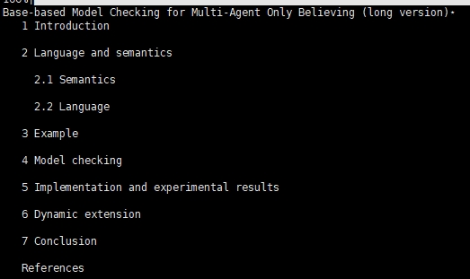

# ChatPDF关于pdf/doc的解析
这里展示一个PDF解析的demo （使用了OCR，目标检测模型），实现了不同内容块的提取，以及多级标题提取功能。
## 项目依赖
推荐 **Linux** 下使用
```
pip install -r requirements
pip install "unstructured[pdf]"

sudo apt install tesseract-ocr
sudo apt install libtesseract-dev

# using layoutparser tool and download the CV models (Detectron2)
pip install layoutparser torchvision && pip install "git+https://github.com/facebookresearch/detectron2.git@v0.5#egg=detectron2"

# layoutparser also supports paddle tool 
pip install "layoutparser[paddledetection]"
```
关于unstructured的安装，请参考 [here](https://unstructured-io.github.io/unstructured/installation/full_installation.html)，
更多细节在[layoutparser](https://github.com/Layout-Parser/layout-parser/blob/main/installation.md)。


## 如何使用
```python
# 多级标题提取demo
python multi_title.py

# 其他内容块提取
python parser.py

# 测试的文件'23.2307.14893.json' 可以用 unstructured 工具生成, 'test2_photo' 可以用 pdf2image工具生成。这些在parser.py中可以找到对应的接口
```
## 多级标题提取效果


## 说明
更详细的中文说明见 [blog](https://zhuanlan.zhihu.com/p/652975673).
非常抱歉由于项目原因，我只能提供一部分demo，不过欢迎提问。
## 参考
- https://zhuanlan.zhihu.com/p/652975673
- https://unstructured.io/
- https://github.com/Layout-Parser/layout-parser/tree/main
- https://github.com/PaddlePaddle/PaddleDetection
- https://github.com/PaddlePaddle/PaddleOCR
- https://github.com/tesseract-ocr/tesseract
